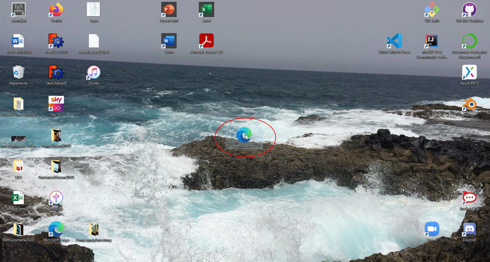

# HelloWorldU4
Diese Anwendung bietet die Ausgabe von "Hello World" auf einer Website.   
Vorraussetzungen:  
- Browser  
  
Öffnen der Website:  
- Öffnen der html Datei (HelloWorld.html) mit dem Browser Ihrer Wahl  
  
